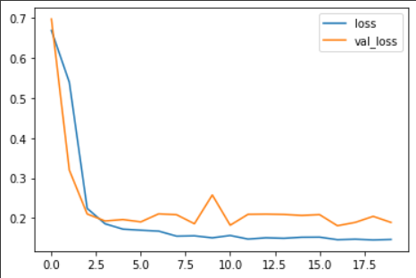
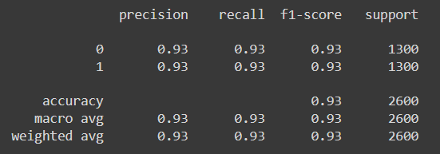
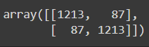
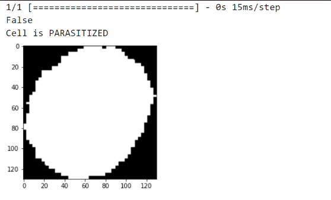

# Deep Neural Network for Malaria Infected Cell Recognition

## AIM

To develop a deep neural network for Malaria infected cell recognition and to analyze the performance.

## Problem Statement and Dataset

## Neural Network Model

# STEP 1:
Import tensorflow and preprocessing libraries

# STEP 2:
Read the dataset

# STEP 3:
Create an ImageDataGenerator to flow image data

# STEP 4:
Build the convolutional neural network model and train the model

# STEP 5:
Fit the model

# STEP 6:
Evaluate the model with the testing data

# STEP 7:
Fit the model and plot the performance.
## PROGRAM
```
import os
import pandas as pd
import numpy as np
import seaborn as sns
import matplotlib.pyplot as plt
from matplotlib.image import imread
from tensorflow.keras.preprocessing.image import ImageDataGenerator
from tensorflow import keras
from tensorflow.keras import layers
from tensorflow.keras import utils
from tensorflow.keras import models
from sklearn.metrics import classification_report,confusion_matrix
import tensorflow as tf
from tensorflow.compat.v1.keras.backend import set_session
config = tf.compat.v1.ConfigProto()
config.gpu_options.allow_growth = True 
config.log_device_placement = True 
sess = tf.compat.v1.Session(config=config)
set_session(sess)

%matplotlib inline

from google.colab import drive
drive.mount('/content/drive')

!tar --skip-old-files -xvf '/content/drive/MyDrive/cell_images.tar.xz' -C '/content/drive/MyDrive'

my_data_dir = '/content/drive/MyDrive/cell_images'

os.listdir(my_data_dir)
test_path = my_data_dir+'/test/'
train_path = my_data_dir+'/train/'

os.listdir(train_path)

len(os.listdir(train_path+'/uninfected/'))

os.listdir(train_path+'/parasitized')[0]

para_img= imread(train_path+'/parasitized/'+os.listdir(train_path+'/parasitized')[0])

plt.imshow(para_img)

dim1 = []
dim2 = []
for image_filename in os.listdir(test_path+'/uninfected'):
    img = imread(test_path+'/uninfected'+'/'+image_filename)
    d1,d2,colors = img.shape
    dim1.append(d1)
    dim2.append(d2)

sns.jointplot(x=dim1,y=dim2)

image_shape = (130,130,3)

help(ImageDataGenerator)

image_gen = ImageDataGenerator(rotation_range=20, 
                               width_shift_range=0.10, 
                               height_shift_range=0.10, 
                               rescale=1/255,
                               shear_range=0.1, 
                               zoom_range=0.1,
                               horizontal_flip=True,
                               fill_mode='nearest' 
                              )

image_gen.flow_from_directory(train_path)

image_gen.flow_from_directory(test_path)

model = models.Sequential()
model.add(layers.Conv2D(filters=32,kernel_size=(3,3),input_shape=image_shape,activation='relu'))
model.add(layers.MaxPooling2D(pool_size=(2,2)))

model.add(layers.Conv2D(filters=64,kernel_size=(3,3),activation='relu'))
model.add(layers.MaxPooling2D(pool_size=(2,2)))

model.add(layers.Conv2D(filters=64,kernel_size=(3,3),activation='relu'))
model.add(layers.MaxPooling2D(pool_size=(2,2)))

model.add(layers.Flatten())

model.add(layers.Dense(128))
model.add(layers.Activation('relu'))

model.add(layers.Dropout(0.5))

model.add(layers.Dense(1))
model.add(layers.Activation('sigmoid'))

model.compile(loss='binary_crossentropy',
optimizer='adam',
metrics=['accuracy'])

model.compile(loss='binary_crossentropy',optimizer='adam',metrics='accuracy')

model.summary()

batch_size = 16

train_image_gen = image_gen.flow_from_directory(train_path,target_size=image_shape[:2],color_mode='rgb',batch_size=batch_size,class_mode='binary')

train_image_gen.batch_size

len(train_image_gen.classes)

train_image_gen.total_batches_seen

test_image_gen = image_gen.flow_from_directory(test_path,
                                               target_size=image_shape[:2],
                                               color_mode='rgb',
                                               batch_size=batch_size,
                                               class_mode='binary',shuffle=False)

train_image_gen.class_indices

results = model.fit(train_image_gen,epochs=20,validation_data=test_image_gen)

losses = pd.DataFrame(model.history.history)

losses[['loss','val_loss']].plot()

model.metrics_names

model.evaluate(test_image_gen)

pred_probabilities = model.predict(test_image_gen)

test_image_gen.classes

predictions = pred_probabilities > 0.5

print(classification_report(test_image_gen.classes,predictions))

confusion_matrix(test_image_gen.classes,predictions)

from tensorflow.keras.preprocessing import image

img = image.load_img('new.png')

img=tf.convert_to_tensor(np.asarray(img))

img=tf.image.resize(img,(130,130))

img=img.numpy()

type(img)

plt.imshow(img)

x_single_prediction = bool(model.predict(img.reshape(1,130,130,3))>0.6)

print(x_single_prediction)

if(x_single_prediction==1):
    print("Cell is UNINFECTED")
else:
    print("Cell is PARASITIZED")
```
## OUTPUT

### Training Loss, Validation Loss Vs Iteration Plot


### Classification Report


### Confusion Matrix



### New Sample Data Prediction

## RESULT:
Thus, a deep neural network for Malaria infected cell recognized and analyzed the performance .

